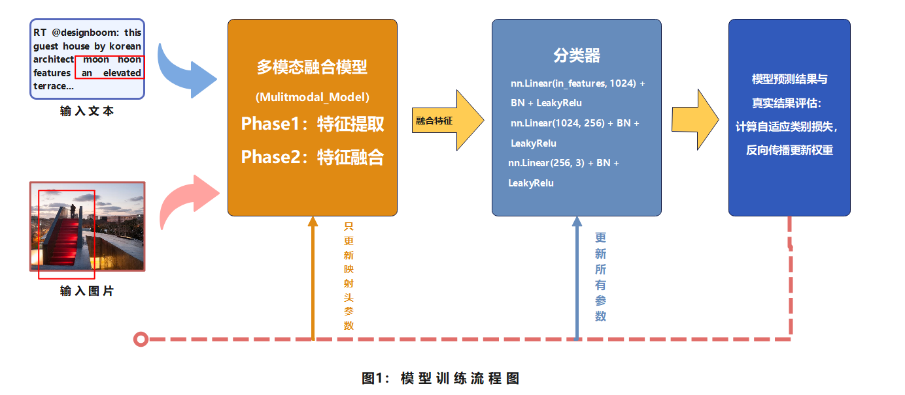
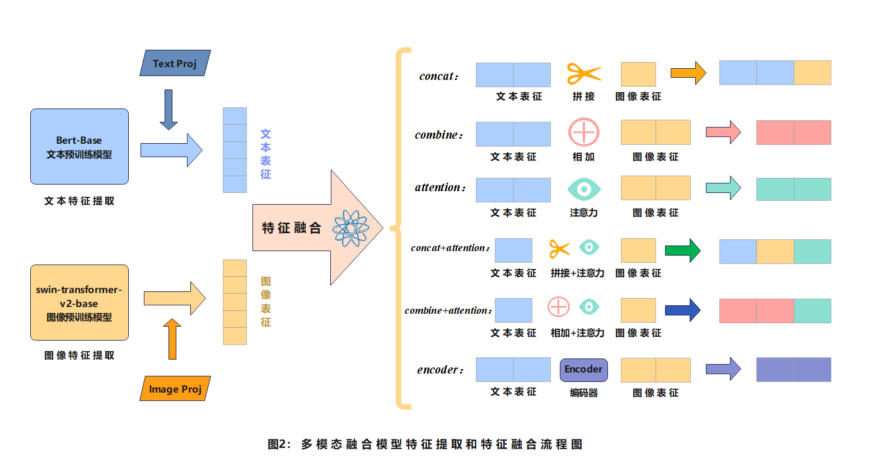

# 多模态情感分析

本实验基于单模态预训练模型（Bert-Base、Swin-Transformer-V2-Base）分别提取文本、图像特征，并采用六种不同的融合方式（拼接、相加、注意力、拼接+注意力、相加+注意力、transformer-encoder）进行特征融合，最后使用全连接层进行情感分类。

## 环境配置

本项目基于 Python3 实现。运行代码需要以下依赖：

```python
# 深度学习框架
torch>=1.9.0
torchvision>=0.10.0

# 自然语言处理
transformers>=4.15.0
nltk>=3.6.5

# 机器学习
scikit-learn>=0.24.2
numpy>=1.19.5

# 图像处理
Pillow>=8.3.1

# 进度条
tqdm>=4.62.3

# 实验追踪
wandb>=0.12.0

# 其他依赖
python-dateutil>=2.8.2
subprocess32>=3.5.4
```

也可以通过以下命令安装依赖：

```bash
pip install -r requirements.txt
```

## 项目结构

以下是主要文件的详细说明:

```python
|-- ablation/  # 消融实验目录
    |-- ablation.py  # 模态消融实现代码
    |-- loss_ablation/  # 损失函数消融实现代码
    |-- concat_ablation/  # 拼接方式消融实现代码
    |-- xx_ablation/  # 特征融合xx方式消融实现代码
| -- assests/  # 流程图
    |-- fig1.png  # 多模态模型训练流程图
    |-- fig2.png  # 特征提取和融合流程图
|-- data/  # 数据目录
    |-- text_image_pair/  # 文本-图像对数据目录，请将数据集放入该目录
        |-- *.txt  # 文本文件,存储情感相关的文字内容
        |-- *.jpg  # 图像文件,存储与文本对应的图片
    |-- train.txt  # 训练集标注文件,格式:guid,tag
    |-- test_without_label.txt  # 测试集文件,格式:guid
|-- logs/  # 日志主目录
    |-- ablation_xx_logs/  # 训练过程日志目录
        |-- xx_log_20250120_120702.txt  # 按时间戳命名的训练日志文件：消融记录日志
        |-- ...
    |-- method_search_logs/  # 融合方式参数搜索日志
        |-- method_search_log_20250119_120702.txt  # 按时间戳命名的搜索日志文件
        |-- ...
    |-- loss_search_logs/  # 损失函数参数搜索日志
        |-- loss_search_log_20250117_120702.txt  # 按时间戳命名的搜索日志文件
        |-- ...
    |-- loss_ablation_logs/  # 损失函数消融实验日志
        |-- loss_ablation_concat_acb.txt  # concat+acb组合的实验日志
        |-- loss_ablation_concat_ce.txt  # concat+ce组合的实验日志
        |-- ...
|-- pretrained_models/  # 预训练模型目录
    |-- bert-base-uncased/  # bert-base-uncased预训练模型目录，需自行下载放置在该目录
    |-- swinv2-base/  # Swin Transformer V2预训练模型目录，需自行下载放置在该目录
|-- results/  # 实验结果目录
    |-- result.txt  # 测试集预测结果
|-- search/  # 参数搜索目录
    |-- search_loss_para.py  # 损失函数参数搜索实现
    |-- search_logs/  # 参数搜索日志目录
        |-- loss_acb_alpha0.25_beta0.75_weight1.5_dropout0.15.txt  # acb损失函数参数组合1的搜索日志
        |-- loss_acb_alpha0.5_beta0.5_weight1.0_dropout0.2.txt  # acb损失函数参数组合2的搜索日志
        |-- loss_ce_alpha0.25_beta0.75_weight1.5_dropout0.15.txt  # ce损失函数参数组合1的搜索日志
        |-- loss_ce_alpha0.5_beta0.5_weight1.0_dropout0.2.txt  # ce损失函数参数组合2的搜索日志
|-- utils/  # 工具类目录
    |-- config.py  # 配置类,包含所有模型训练和评估需要的参数
    |-- dataload.py  # 数据加载类,实现数据集的加载和预处理
|-- main.py  # 主程序,包含训练和评估的完整流程
|-- multimodel.py  # 多模态模型实现代码
|-- README.md  # 项目说明文档
|-- report.pdf  # 实验报告
|-- requirements.txt  # 项目依赖包列表
|-- trainer.py  # 训练器实现代码,包含训练、验证和预测的具体过程
```

## 模型训练流程


## 特征提取和融合流程


## 运行流程

1. 准备数据集并放入 data/text_image_pair/ 目录

2. 下载预训练模型并放入 pretrained_models/ 目录

3. 运行训练脚本，例如：

```bash
python main.py --batch_size 32 --learning_rate 1e-5 --num_epochs 30 --wandb True --feature_fusion encoder --loss_type acb --alpha 0.25 --beta 0.75
    --beta 0.75
```

## 主要参数说明

- `--batch_size`：训练批次大小，默认32
- `--learning_rate`：学习率，默认1e-5  
- `--num_epochs`：训练轮数，默认30
- `--feature_fusion`：特征融合方式，可选：concat/attention/combine/encoder等
- `--loss_type`：损失函数类型，可选：acb/ce
- `--alpha`：focal loss的alpha参数，默认0.25
- `--beta`：边界损失的beta参数，默认0.75

更多参数说明请参考 main.py 中的注释。

## 消融实验

你可以运行`ablation`目录下的脚本进行消融实验：

```bash
示例：
python ablation/ablation.py
```

## 参数搜索

你可以运行`search`目录下的脚本进行参数搜索：

```bash
示例：
python search/search_feature_fusion.py
```

注意：本项目模型的训练日志详见wanbd地址：[https://wandb.ai/leofyfan-east-china-normal-university/projects](https://wandb.ai/leofyfan-east-china-normal-university/projects)

## 致谢

特别感谢以下研究工作对本项目的启发：

[1] Liu Q, Li J, Gu B, et al. TSAIE: Text Sentiment Analysis Model Based on Image Enhancement[J]. Frontiers of Data and Computing, 2022, 4(3): 131-140

[2] Devlin J, Chang M W, Lee K, et al. BERT: Pre-training of Deep Bidirectional Transformers for Language Understanding[J]. arXiv preprint arXiv:1810.04805, 2018

[3] Liu Z, Hu H, Lin Y, et al. Swin Transformer V2: Scaling Up Capacity and Resolution[C]. Proceedings of the IEEE/CVF Conference on Computer Vision and Pattern Recognition (CVPR), 2022: 12009-12019

